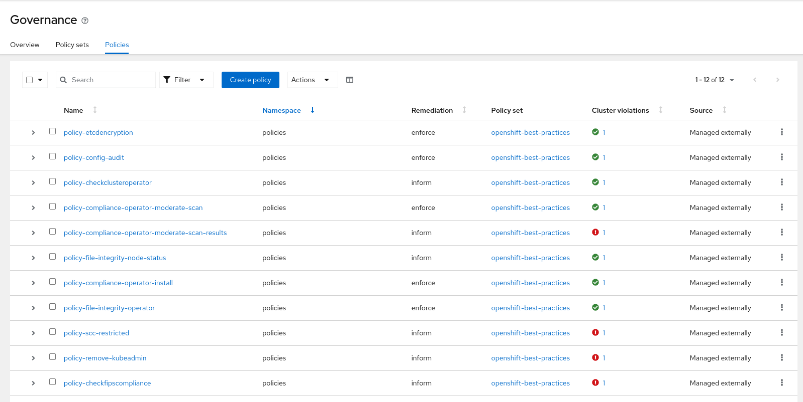

# Setting Up RHACM-Policies with ArgoCD for OpenShift Best Practices

Welcome to this tutorial on configuring ArgoCD to deploy Policies for OpenShift best practices using Red Hat Advanced Cluster Management (RHACM). In this guide, we'll walk you through the steps to set up and manage policies efficiently. This PolicySet will help you configure OpenShift for best practices, enhancing security and ensuring compliance. ArgoCD, a popular GitOps tool, is the perfect choice for managing policies in a Kubernetes environment.

**Note:** This approach is considered a best practice and comes highly recommended.
**Note:** This will be a list of short tutorials.

The entire setup will take just a few minutes, so let's get started!

## Prerequisites

Before we dive into the tutorial, make sure you have the following prerequisites in place:

1. Access to a OpenShift Cluster with RHACM 2.8 installed.
2. `kubectl` and `oc` command-line tools installed.
3. download this repository and execute the provided script as kubeadmin

## Setup

To simplify the setup process, we've provided a script that automates the deployment of necessary Kubernetes resources for you. Here's how you can set up ArgoCD for deploying Policies:

1. Create a new file named `setup-argocd.sh` and paste the provided script into it.

```bash
#!/bin/bash

# List of Kubernetes files to apply
files=(
    "01_namespaces.yaml"
    "02_managedclustersetbinding.yaml"
    "03_installoperator.yaml"
    "04_argocd.yaml"
    "05_applications.yaml"
    "06_appproject.yaml"
    "07_placement.yaml"
)

# Function to apply a file with retries (especially we need to wait till GitopsOperator is installed)
apply_with_retry() {
    local file="$1"
    local retries=3
    local interval=10

    for ((i=0; i<retries; i++)); do
        echo "Applying $file (Attempt $((i+1)))"
        oc apply -f "$file"
        if [ $? -eq 0 ]; then
            echo "$file applied successfully"
            return 0
        else
            echo "Error applying $file. Retrying in $interval seconds..."
            sleep $interval
        fi
    done

    echo "Failed to apply $file after $retries attempts"
    return 1
}

# Iterate over the files and apply them with retries
for file in "${files[@]}"; do
    apply_with_retry "$file" || exit 1
done

echo "All files applied successfully"
```

2. Save the file and make it executable by running:

```bash
chmod +x setup-argocd.sh
```

3. Execute the script to set up ArgoCD and deploy the Policies:

```bash
./setup-argocd.sh
```

## Understanding the YAML Files

Now, let's briefly explain the contents of the YAML files provided in the script:

1. `01_namespaces.yaml`: Defines two namespaces, `policies` and `openshift-gitops`.

2. `02_managedclustersetbinding.yaml`: Binds a ManagedClusterSet to the `policies` namespace.

3. `03_installoperator.yaml`: Installs the OpenShift GitOps Operator in the `openshift-gitops` namespace.

4. `04_argocd.yaml`: Defines the ArgoCD configuration in the `policies` namespace.

5. `05_applications.yaml`: Configures an ArgoCD application for deploying the PolicySet, pointing to the `ocp-best-practices-policyset`.

6. `06_appproject.yaml`: Sets up an ArgoCD application project.

7. `07_placement.yaml`: Defines placement-definitions for the Policies.

At the end of the setup, you'll find the deployed policies in the RHACM Governance UI.



## Conclusion

By following this tutorial and executing the provided script, you've efficiently set up ArgoCD for deploying Policies in your OpenShift cluster. This PolicySet offers a good start for enforcing best practices, enhancing security, and ensuring compliance. Utilizing Git, you can easily customize and manage your policies, maintaining your cluster in the desired state. Embrace the power of streamlined policy management with RHACM and ArgoCD!
